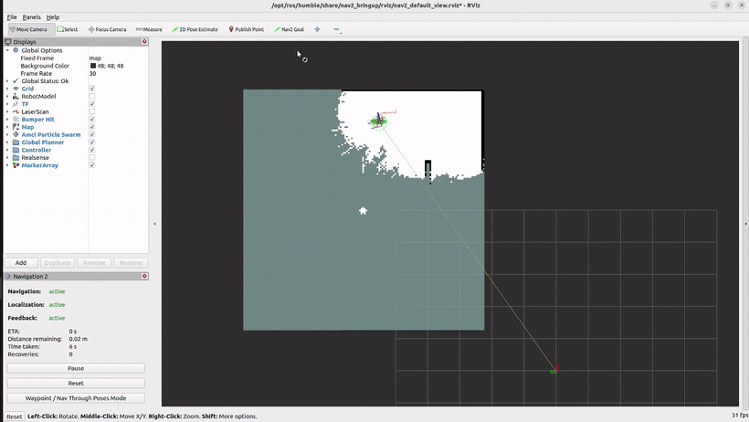

# Autonomous SLAM Exploration with Deep Reinforcement Learning (ROS 2)

A reinforcement-learning agent that decides **where a mobile robot should go next
to explore and map an unknown indoor environment**, built on a full ROS 2
robotics stack (Nav2, SLAM Toolbox, Gazebo). A DQN agent selects high-level
navigation goals from the live SLAM map; the navigation stack executes the
motion; the map that results feeds back as the next observation.

This repository contains the core code from my MSc thesis and is organized to
show how the whole system fits together — the reinforcement learning, the
parallel training, and the engineering required to run all of it on a single
machine.

> **Thesis:** [Technical University of Crete institutional repository](https://dias.library.tuc.gr/handle/123456789/43922) · [DOI: 10.26233/heallink.tuc.105742](https://doi.org/10.26233/heallink.tuc.105742)
>
> A figure-driven summary of the method and results is in [`REPORT.md`](REPORT.md).



*The agent exploring and building a SLAM map in real time (RViz).*

---

## What this project demonstrates

- **Integrating reinforcement learning with a real robotics stack** — not a toy
  gridworld, but DQN driving Nav2 + SLAM Toolbox + Gazebo through a custom Gym
  environment.
- **Parallel RL training** — several independent simulation stacks running at
  once, each isolated by its own ROS domain and Gazebo server, feeding a single
  shared model update.
- **Systems engineering under tight compute limits** — the whole thing was made
  to train on one local machine, through simulation speed-up, a small CNN, a
  compact action space, and a fault-tolerance layer that recovers from
  simulator failures automatically.

---

## The problem

A robot is placed in an indoor environment it has no map of, and must explore it:
drive around, build a map with SLAM, and cover as much of the space as possible
without losing track of where it is. The hard part is **deciding where to go
next**. Classic approaches use hand-designed rules (e.g. always head to the
nearest frontier between known and unknown space). Here, that decision is
**learned**: the agent looks at the map built so far and chooses the goal that it
expects will reveal the most new space while keeping localization healthy.

## System architecture

The agent sits on top of a conventional robotic stack and only makes the
high-level decision; everything below it is handled by mature ROS 2 components.

```
        ┌─────────────────────────────────────────────────────────┐
        │                  DQN agent (Stable-Baselines3)           │
        │      observation: 64x64 SLAM map image  →  Q-values      │
        └───────────────▲───────────────────────────┬─────────────┘
                        │ observation, reward        │ action (goal)
        ┌───────────────┴───────────────────────────▼─────────────┐
        │         Gym environment  (XelonaEnv, simple_gymFeb.py)   │
        └───────────────▲───────────────────────────┬─────────────┘
                        │                            │
        ┌───────────────┴───────────────────────────▼─────────────┐
        │     ROS 2 Communication Interface  (multi_comFeb.py)     │
        │   publishers · subscribers · service & action clients    │
        └──┬─────────────┬──────────────┬───────────────┬──────────┘
           │             │              │               │
       SLAM Toolbox    Nav2         Gazebo (physics,   tf2 (map→odom→
       (/map,        (goal → path   spawn/delete,      base_link)
        map→odom)     → motion)      pause/reset)
```

The agent observes, Nav2 executes, SLAM updates the map, and the loop repeats
until the environment is explored, the step budget runs out, or localization
fails.

### The Gym ↔ ROS 2 bridge

Stable-Baselines3 expects a standard OpenAI Gym environment (`init`, `step`,
`reset`, `close`). Behind those four functions sits a dedicated **ROS 2
Communication Interface** that owns every ROS endpoint the environment needs:

- **Action** — the agent's chosen coordinate is converted into a Nav2 goal and
  sent through the Simple Commander API; Nav2 plans and drives.
- **Observation** — a subscriber on `/map` provides the occupancy grid and a tf2
  listener provides the robot pose; together they produce the observation image.
- **Reset** — service calls delete and respawn the robot and reload the SLAM
  pose graph, so every episode starts from a clean, controlled state.

### State, actions, reward

- **State** — a single 64×64 grayscale image of the SLAM occupancy grid (free =
  white, unknown = gray, occupied = black) with the robot's own position drawn
  on it. Resizing to a fixed 64×64 gives the network a constant input size and
  the right level of abstraction (global structure, not individual cells).
- **Actions** — 25 discrete goals on a 5×5 grid over the workspace (1.5 m
  spacing). An action is a *navigation decision*, not a motor command.
- **Reward** — positive for revealing new space around the chosen goal, a large
  bonus for completing the map, and penalties for losing localization or for
  choosing a non-progressive (repeated) goal. Full definition in
  [`REPORT.md`](REPORT.md).


*Observation images: the SLAM map with the robot's position marked.*

## Parallel training

Collecting experience from a single environment is slow, because each step is a
full navigation action with SLAM running. Training therefore runs **several
environments in parallel** via Stable-Baselines3's `SubprocVecEnv`. Each parallel
instance gets:

- its own **ROS domain** (`ROS_DOMAIN_ID`), so the ROS graphs don't interfere,
- its own **Gazebo server** (`GAZEBO_MASTER_URI`), so the simulations are
  isolated,
- its own **Communication Interface** instance.

The experience from all instances feeds a single model update, cutting
data-collection time roughly in proportion to the number of environments — on top
of running each simulation at 10× real time.


*Two parallel RL environments, each with its own ROS 2 interface, feeding a
shared CNN + replay-buffer update (thesis Fig. 4.7).*

## Engineering under computational constraints

A recurring theme of the project is doing this on **one local machine**, without
a GPU cluster. Several design decisions follow directly from that:

- **Simulation speed-up (10×)** — Gazebo's clock runs faster than real time, so
  thousands of episodes finish in a practical amount of wall-clock time. The
  LiDAR update rate had to be retuned so messages didn't pile up faster than
  SLAM and the costmaps could consume them.
- **A deliberately small CNN** — three conv layers plus one dense layer. In this
  system a training step is dominated by SLAM and a full navigation action, so
  the network is never the bottleneck; a bigger one would slow convergence
  without helping.
- **A compact 5×5 action space** — every step is expensive (a full navigation
  action), so a formulation needing many more steps would be a change of scale,
  not a small cost.
- **All seven training worlds in a single `.world` file** — each with its own
  local origin. Switching worlds between episodes just respawns the robot at a
  different origin, so Gazebo never has to restart.
- **Sub-path execution** — instead of sending Nav2 the goal in one piece, the
  path is split into shorter consecutive segments (proportional to the distance).
  This made actions complete far more reliably and stopped the robot getting
  stuck in corners.
- **Watchdog-based fault tolerance** — long-running operations (reset, first
  step, action) are guarded by watchdog threads. If one stalls past a timeout,
  a lockfile-coordinated global restart (`stop_envs.sh`) tears down and relaunches
  the simulation stacks, so an overnight training run survives simulator crashes
  without manual intervention.

## Results (summary)

In four **unseen** test worlds, the trained agent was compared against a random
baseline that selects from the same action space:

| Metric | Trained agent | Random baseline |
|---|---|---|
| Success rate (40 episodes) | **70%** (28/40) | 15% (6/40) |
| Final map coverage | 84–94% | 78–86% |
| Episodes lost to localization failure | **0** | 15% (6/40) |

Training converged (mean episode reward rose from ~1.5 to ~6.5 and stabilized).
Full analysis and figures are in [`REPORT.md`](REPORT.md).


## Repository structure

```
ros2-rl-autonomous-exploration/
├── thesis code/
│   ├── simple_gymFeb.py     # Gym environment + DQN training/inference entry points
│   ├── multi_comFeb.py      # ROS 2 communication layer (Nav2 / SLAM / Gazebo)
│   ├── run_multi_envs.sh     # Launch N parallel simulation stacks, then train
│   └── stop_envs.sh          # Fault-recovery: kill and relaunch the stacks
├── docs/figures/             # Figures used in REPORT.md (from the thesis)
├── media/                    # live_mapping.gif
├── REPORT.md                 # Method & results summary (Approach + Results)
└── README.md
```

## Tech stack

Python · PyTorch · Stable-Baselines3 (DQN) · ROS 2 · Nav2 · SLAM Toolbox ·
Gazebo · OpenAI Gym · TurtleBot3 Waffle (2D LiDAR)

## A note on running it

This is thesis code shared as a portfolio piece. Reproducing a full run requires
a configured ROS 2 + Nav2 + SLAM Toolbox + Gazebo installation with the
TurtleBot3 packages, plus the custom Gazebo worlds and the saved SLAM pose
graphs referenced in the code — which are part of the wider thesis setup and are
not included here. The code is intended to show the design and implementation of
the system; the [thesis](https://doi.org/10.26233/heallink.tuc.105742) is the
complete reference.
