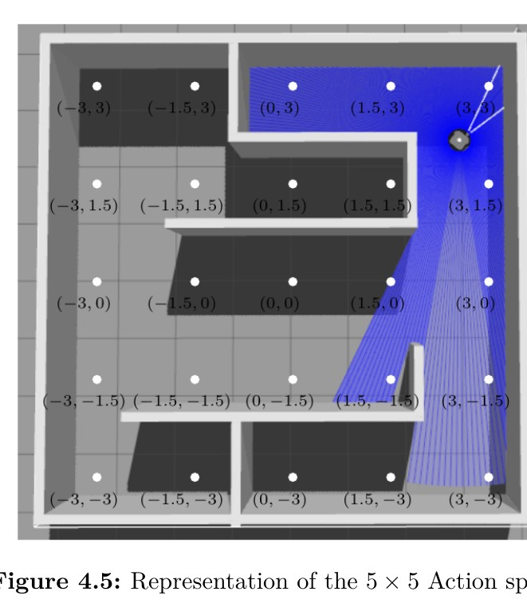
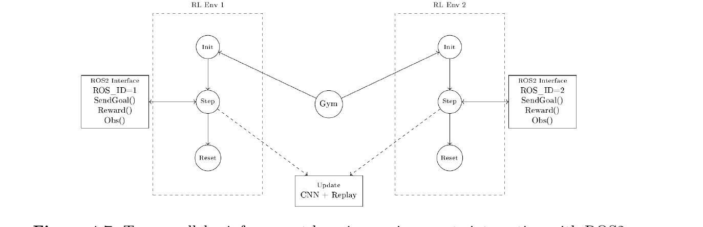
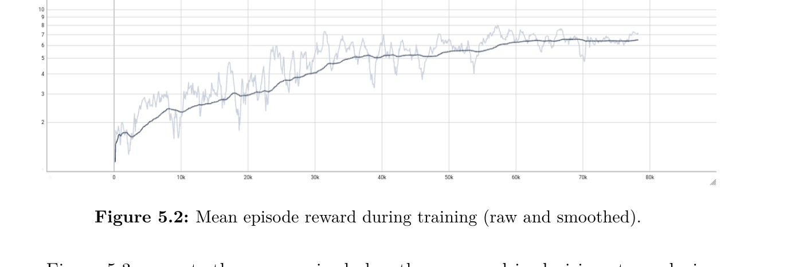
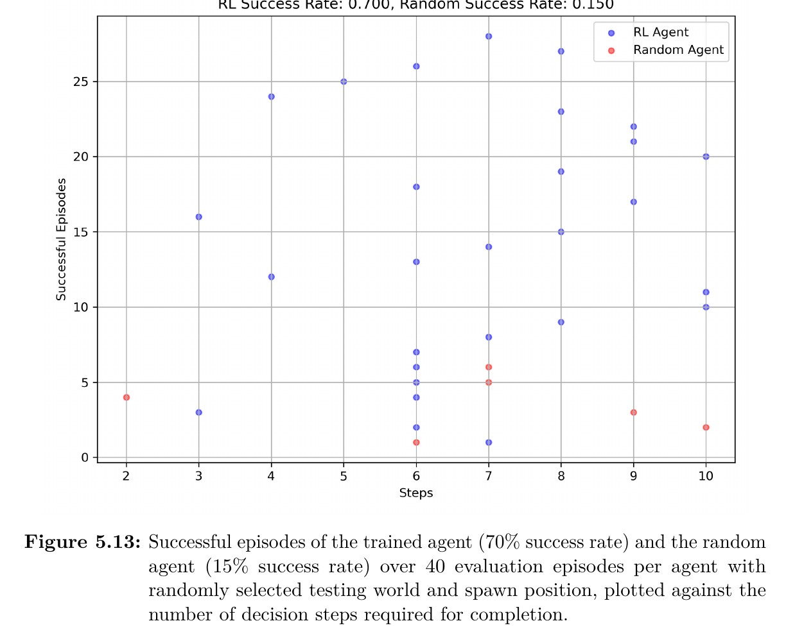
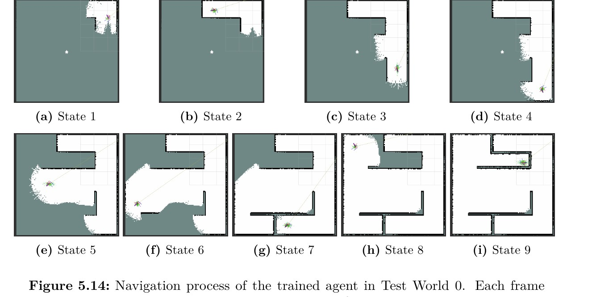

# Method & Results

A condensed, figure-driven summary of the approach and the experimental results.
For the complete treatment (background, related work, full derivations), see the
thesis: [TUC repository](https://dias.library.tuc.gr/handle/123456789/43922) ·
[DOI: 10.26233/heallink.tuc.105742](https://doi.org/10.26233/heallink.tuc.105742).

All figures below are from the thesis.

---

## Approach

### Problem as a Markov Decision Process

Goal selection is modelled as an MDP `M = (S, A, P, R, γ)`:

- **State** `s` — the current SLAM map with the robot's position drawn on it.
- **Action** `a` — one of 25 candidate goal coordinates on a fixed grid.
- **Transition** `P` — produced by the simulation itself (physics, SLAM updates,
  and Nav2 executing the goal). The path planner has a strong influence: the same
  action from the same state can end differently depending on the path computed
  and replanned along the way.
- **Reward** `R` — scores newly explored space around the chosen goal and
  penalizes localization failure and non-progressive choices.
- **γ** — discount factor (0.85).

An episode starts with the robot at a random spawn in a world it has no map of,
and ends when (1) coverage exceeds 95%, (2) the 10-step horizon is reached, or
(3) a severe localization failure occurs. An episode is **successful** when it
ends through sufficient coverage.

### State and observation

The observation is a single grayscale image built from the occupancy grid that
SLAM Toolbox publishes on `/map`. Each cell is free, unknown, or occupied; these
are mapped to white / gray / black. The robot's own position is drawn explicitly
as a small circular mark, because the same map means different things depending
on where the robot stands in it — with the mark, the agent can connect its pose
to the exploration opportunities visible in the image. The image is resized to a
fixed **64×64**, which gives every observation the same dimensionality and the
right level of abstraction (global structure rather than individual cells).

$$
m'_{i,j} =
\begin{cases}
0, & m_{i,j} = 0 \\
127, & m_{i,j} = -1 \\
255, & m_{i,j} = 255 \\
198, & m_{i,j} \in \mathrm{pos}_{x,y}
\end{cases}
\qquad
\forall i: 0 \leq i \leq W,\ \forall j: 0 \leq j \leq H
$$
where, 
$$
r = \frac{r_{\mathrm{meters}}}{\mathrm{resolution}}
= \frac{0.15}{\mathrm{resolution}},
\qquad
\mathrm{pos}_{x,y} =
\{(i,j) : (i-x)^2 + (j-y)^2 \leq r^2\}
$$

### Action space

The action space is **25 discrete goals on a 5×5 grid** over the workspace, with
1.5 m spacing between adjacent goals. Selecting an action sends the corresponding
coordinates to Nav2 as a goal; Nav2 plans a path from the robot's current
position and drives it there. The action succeeds when the robot ends within
0.3 m of the goal. Crucially, the robot collects LiDAR measurements along the
*entire path*, so the traversal itself grows the map — reaching the goal is only
half of what an action does.

A compact discrete set was a deliberate choice: every step is a full navigation
action with SLAM running, so a continuous or much denser action space would
multiply an already expensive step count.

### Reward system

The reward encodes the objectives — reveal new space, don't waste moves, and stay
away from goals whose paths break localization:

| Condition | Reward |
|---|---|
| Map coverage ≥ 96% (episode success) | **+3.0** |
| Local patch exploration rate ≥ 0.6 | +1.0 |
| Local patch exploration rate in [0.15, 0.6) | +0.5 |
| Localization error (‖map − odom‖² ≥ 0.6), terminates episode | −0.5 |
| Non-progressive action (same goal as before) | **−5.0** |
| Otherwise | 0.0 |

Two design points are worth highlighting:

- **The exploration reward is measured locally**, on a 2×2 m patch centered on
  the chosen goal, counting cells that turned from unknown to known. A reward
  measured on the *global* map change would partly score the path planner's
  internal behavior (it reveals space anywhere along a route that varies with
  replanning), rather than the agent's actual decision.
- **The −5.0 penalty for repeated goals** was added after observing a degenerate
  early-training behavior where the agent settled into selecting a
  non-progressive goal, collecting neither reward nor risk. The heavy penalty
  removes that option and keeps learning oriented toward movement and coverage.

### Network and algorithm

The state is an image, so the Q-network uses a small convolutional feature
extractor — three convolutional layers followed by one dense layer producing a
64-dimensional feature vector:

| Layer | Type | Output | Params |
|---|---|---|---|
| Input | — | (1, 64, 64) | 0 |
| Conv1 | Conv2D(8, 5×5, s=2) + ReLU | (8, 30, 30) | 208 |
| Conv2 | Conv2D(16, 5×5, s=2) + ReLU | (16, 13, 13) | 3,216 |
| Conv3 | Conv2D(8, 3×3, s=2) + ReLU | (8, 6, 6) | 1,160 |
| Flatten | — | (288) | 0 |
| FC | Dense(64) + ReLU | (64) | 18,496 |

The learning algorithm is **DQN** (from Stable-Baselines3), chosen because the
action space is a small discrete set — exactly DQN's setting — and because it
converges relatively quickly in this navigation setup. Using an established,
well-tested implementation was itself a decision: the contribution is the
environment, state and reward, not a re-implementation of the algorithm.

Key hyperparameters:

| Parameter | Value |
|---|---|
| Policy | CnnPolicy |
| Batch size | 32 |
| Replay buffer | 5000 |
| Learning rate | 3×10⁻⁴ |
| Gamma | 0.85 |
| Exploration fraction | 0.4 |
| Final ε | 0.1 |
| Learning starts | 1250 |
| Gradient steps | 4 |
| Target update interval | 2000 |

### System integration & parallelism

The robotic stack is wrapped behind the four Gym functions, with the ROS 2
Communication Interface owning every endpoint (publishers, subscribers, service
and action clients). Two implementation details mattered a lot in practice:

- **All seven worlds in a single `.world` file**, each with its own local origin
  — switching worlds is just respawning the robot at a different origin, so
  Gazebo never restarts.
- **Sub-path execution** — the planned path is executed as a sequence of shorter
  segments (their number proportional to the distance to the goal), which made
  actions complete more reliably and prevented the robot from getting stuck in
  corners.

Training runs several environments in parallel with `SubprocVecEnv`; each gets
its own ROS domain and Gazebo server, and all feed one shared model update.

---

## Results

### Training convergence

The agent was trained for 100,000 decision steps across the seven worlds (random
world and spawn each episode). The mean episode reward rises from about 1.5–2 at
the start to about 6.5, with a steady upward trend over the first 60,000 steps,
then stabilizes at 6.4–6.5. Since positive reward comes only from exploring new
space and completing the map, this shows the agent learned to select goals that
reveal new regions and to finish episodes successfully. Notably, ε had already
decayed to its final 0.1 within the first 40% of training, so the continued
improvement after that reflects learned behavior rather than exploration.

*Mean episode reward during training (raw and smoothed).*

The training loss follows the non-monotonic shape expected of DQN (targets come
from a periodically updated target network and the replay-buffer distribution
shifts as the policy improves): it dips, rises during the phase where the reward
climbs fastest, then declines steadily to ~0.15 — consistent with convergence.

### Evaluation protocol

Evaluation had two stages: (1) the trained agent in the seven **training** worlds,
and (2) the trained agent vs. a **random baseline** in four **unseen testing**
worlds. The random agent selects uniformly from the same 5×5 action space, with
no learning or memory. Three metrics were used: mean simulation time per coverage
level, coverage per decision step, and localization stability (the smoothed
map–odom distance). Because runs are non-deterministic (LiDAR noise, planner
variation), metrics are averaged over repeated episodes.

### Trained agent vs. random baseline (unseen worlds)

The headline comparison, over 40 evaluation episodes per agent with randomly
selected test world and spawn:

| Metric | Trained agent | Random baseline |
|---|---|---|
| **Success rate** | **70%** (28/40) | 15% (6/40) |
| Final map coverage | 84–94% | 78–86% |
| Episodes lost to localization failure | **0** | 15% (6/40) |

The trained agent doesn't just complete the mapping task more often — it also
**avoids the trajectories that compromise localization**: none of its episodes
ended in localization failure, versus 15% for the random agent. This is
consistent with the localization-stability metric, where the trained agent
maintains lower and steadier map–odom distances.

*Each point is a successful episode, plotted against the decision steps it took.
The trained agent's successes span the range and cluster in the 6–10 step region;
the random agent's few successes are scattered.*

### Qualitative behavior

Looking at individual successful episodes, a consistent strategy emerges: early
on, when most of the map is unknown, the agent picks goals **close to itself** —
which keeps localization loss low — and detects and closes small gaps in the map
in the final steps. The sequence below shows the SLAM map being progressively
built over one episode.

*Navigation states of one successful episode, ordered chronologically — the map
grows as the agent explores (thesis Fig. 5.14).*

---

## Conclusion

The results show that high-level exploration goal selection **can be learned**
within a realistic robotic stack, and that the learned policy generalizes to
layouts it never saw during training — outperforming a random baseline on
coverage, speed, and (especially) localization stability. The system also stands
as a demonstration that this kind of integrated RL-plus-robotics experiment can
be built and trained on a single machine, given careful engineering around the
simulation, the action/observation design, and fault tolerance.
